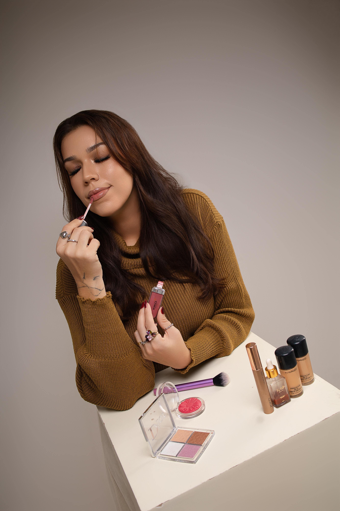

<!DOCTYPE html><html lang="pt-BR">
<head>
  <meta charset="UTF-8" />
  <meta name="viewport" content="width=device-width, initial-scale=1.0" />
  <title>Rivia Mara Make-up</title>
  
</head>
<body>
  <header>
    
    <h1>Rivia Mara Make-up</h1>
    
Realçando sua beleza para momentos especiais

    <a href="https://wa.me/" class="button">Agende seu horário</a>
  </header>  <nav>
    <a href="#sobre">Sobre Mim</a>
    <a href="#portfolio">Portfólio</a>
    <a href="#servicos">Serviços</a>
    <a href="#contato">Contato</a>
  </nav>  <section id="sobre">
    <h2>Sobre Mim</h2>
    
Sou Rivia Mara, maquiadora profissional apaixonada por realçar a beleza de cada cliente. Atuo há anos no mercado de maquiagem para noivas, formandas e eventos especiais, sempre com muito cuidado, produtos de qualidade e atualização constante.

  </section>  <section id="portfolio" class="portfolio">
    <h2>Portfólio</h2>
    
    
    
  </section>  <section id="servicos">
    <h2>Serviços</h2>
    <ul>
      <li>Maquiagem Social</li>
      <li>Maquiagem para Noivas</li>
      <li>Maquiagem para Formandas</li>
      <li>Workshops e Cursos Rápidos</li>
    </ul>
  </section>  <section id="contato">
    <h2>Contato</h2>
    
Entre em contato pelo WhatsApp ou Instagram para agendar seu horário.

    
Whats
